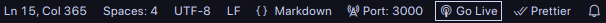

# Portfolio

<div align="center">


</div>

## Table of Contents

1. [Overview](#overview)
2. [Contributing/Cloning Instructions](#contributingcloning-instructions)
3. [HTML Elements and Tags Used](#html-elements-and-tags-used)

## Overview

This project features ma

## Contributing/Cloning Instructions

1. Make sure that Git is installed and setup correctly on your machine. If not, follow the installation instructions in their official website.

2. Clone the repository using the following command:

    ```git
    git clone https://github.com/ivanreeve/webdev-portfolio.git
    ```

3. Use any IDE or text editor you want to open your local copy of the repository. For example, on Visual Studio Code, you need to install an extension called "Go Live" to start a development server. This allows you to view the changes in real time as you edit the files via hot reloading.

    

    To start the live server on Visual Studio Code, just click the button indicated by the white border with the label "Go Live". This should start the development server right away.

## HTML Elements and Tags Used

| Tag            | Description                                                                                          |
|----------------|------------------------------------------------------------------------------------------------------|
| `<!DOCTYPE>`   | Specifies the document type and version (HTML5 in this case).                                         |
| `<html>`       | The root element that encloses the entire HTML document.                                              |
| `<head>`       | Contains metadata about the document, such as title and meta tags.                                    |
| `<meta>`       | Provides metadata such as character encoding and viewport settings.                                   |
| `<title>`      | Sets the title of the webpage that appears in the browser tab.                                        |
| `<body>`       | Contains the visible content of the webpage.                                                          |
| `<header>`     | Defines the header section, containing the logo, navigation, and title.                               |
| `<div>`        | A generic container used to group elements for alignment and layout (here, for center alignment).     |
| `<br>`         | Inserts a line break.                                                                                 |
| ``        | Displays an image (e.g., author logo and project images).                                             |
| `<h1>`         | The main heading of the page (e.g., "Ivan Reeve Lopez").                                              |
| `<nav>`        | Defines a section for navigation links.                                                              |
| `<ul>`         | Creates an unordered list (used for navigation links).                                                |
| `<li>`         | Represents a list item inside the unordered list.                                                     |
| `<a>`          | Creates hyperlinks to other sections or pages (used in navigation and external links).                |
| `<hr>`         | Creates a horizontal rule or divider between sections.                                                |
| `<main>`       | Represents the main content of the document.                                                          |
| `<section>`    | Defines sections of content (e.g., about, projects, skills, contact).                                 |
| `<article>`    | Represents independent content blocks (e.g., project descriptions).                                   |
| `<center>`     | Centers content within its container (deprecated, but still used in this document).                   |
| `<h2>`         | Subheading level 2 (used for sections like "About Me", "Projects").                                   |
| `<q>`          | Denotes a short inline quotation.                                                                     |
| `<i>`          | Italicizes the enclosed text (used for emphasis or philosophy quotes).                                |
| `<p>`          | Defines a paragraph of text.                                                                          |
| `<b>`          | Boldfaces the enclosed text (e.g., to emphasize programming languages).                               |
| `<h3>`         | Subheading level 3 (used for project titles).                                                         |
| `<figure>`     | Groups media content (like images) along with captions.                                               |
| `<table>`      | Creates a table structure (used for proficiency and technology list).                                 |
| `<thead>`      | Groups the header content of the table.                                                               |
| `<tbody>`      | Groups the body content of the table.                                                                 |
| `<tr>`         | Defines a row in the table.                                                                           |
| `<th>`         | Defines a header cell in the table.                                                                   |
| `<td>`         | Defines a cell in the table for data.                                                                 |
| `<form>`       | Represents a form that allows user input (used for the contact section).                              |
| `<label>`      | Defines a label for form elements.                                                                    |
| `<input>`      | Accepts user input (e.g., email, text) in a form.                                                     |
| `<textarea>`   | Provides a multiline input control for entering text.                                                 |
| `<footer>`     | Defines the footer section (contains copyright and social links).                                     |
